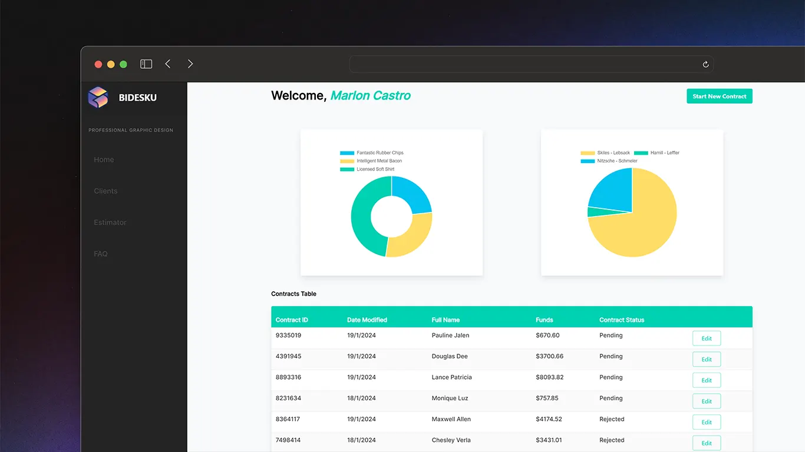

<h1 align="center">
  Welcome to BiDeskU v2 | Professional graphic design service 🤓📊
</h1>

## 🖥️ Preview


## 🦾 Technologies

- [React JS](https://es.reactjs.org/)

- [Bulma](https://bulma.io/documentation/)

- [Chart.js](https://www.chartjs.org/)

- [Vercel](https://vercel.com/)

- [Framer Motion](https://www.framer.com/motion/)

## 🚀 Get Started

You need to be using:

- [Git](https://git-scm.com/downloads)

- [Nodejs v16 or higher](https://nodejs.org/es/download/)

Clone the repository & install dependencies:

```bash

git clone https://github.com/eriandev/bidesku-v2

cd bidesku-v2

npm install

```

## 🤝 Contributing

Contributions, issues and feature requests are welcome!

<br />

Feel free to check [issues page](https://github.com/MGeovany/bidesku-v2/issues).
